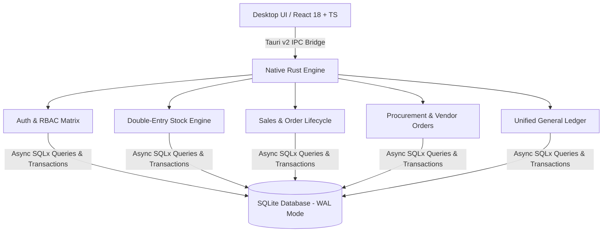

# 🏛️ ميزان ERP | MIZAN ERP
### نظام إدارة المؤسسات المعياري لسطح المكتب (Local-First Modular Desktop ERP)

[](https://github.com/Omar-b381/MIZAN-ERP/releases)
[](https://www.rust-lang.org/)
[](https://tauri.app/)
[](https://reactjs.org/)
[](https://www.sqlite.org/)
[](LICENSE)
[]()

> **"نظام محلي، معياري، فائق السرعة، ومصمم خصيصًا لتلبية متطلبات الشركات والمؤسسات في مصر والشرق الأوسط بدقة رياضية ومحاسبية مطلقة."**

---

## 📑 جدول المحتويات (Table of Contents)

1. [نظرة عامة على المشروع (Project Description)](#-نظرة-عامة-على-المشروع-project-description)
2. [المشكلة التي يعالجها النظام (Problem It Solves)](#-المشكلة-التي-يعالجها-النظام-problem-it-solves)
3. [الدافع وقصة المشروع (Motivation & Story)](#-الدافع-وقصة-المشروع-motivation--story)
4. [البنية الهندسية والتقنيات (Tech Stack & Architecture)](#-البنية-الهندسية-والتقنيات-tech-stack--architecture)
5. [المراحل والقدرات المنجزة (Features & Milestones)](#-المراحل-والقدرات-المنجزة-features--milestones)
6. [التحديات الهندسية والحلول (Challenges & Solutions)](#-التحديات-الهندسية-والحلول-challenges--solutions)
7. [دليل التثبيت والتشغيل (Getting Started)](#-دليل-التثبيت-والتشغيل-getting-started)
8. [القيود وخارطة الطريق المستقبلية (Limitations & Roadmap)](#-القيود-وخارطة-الطريق-المستقبلية-limitations--roadmap)
9. [الجمهور المستهدف (Intended Use)](#-الجمهور-المستهدف-intended-use)
10. [الترخيص والمصادر المرجعية (Credits & License)](#-الترخيص-والمصادر-المرجعية-credits--license)

---

## 🌟 نظرة عامة على المشروع (Project Description)

**ميزان ERP** هو تطبيق سطح مكتب محلي من الجيل التالي (Native Desktop Application) لإدارة موارد المؤسسات (ERP). تم بناؤه من الصفر باستخدام لغة **Rust** كطبقة خلفية فائقة الأداء ونظام **SQLite** في وضع الذاكرة المزامنة (WAL Mode)، ومغلف عبر إطار عمل **Tauri v2** مع واجهة أمامية حديثة مبنية بـ **React & TypeScript**.

يهدف المشروع إلى توفير بديل قوي، آمن، وخفيف الوزن لأنظمة ERP السحابية البطيئة والمكلفة، مع التركيز على **الخصوصية التامة للبيانات (Local-First)**، ودعم كامل للغة العربية والاتجاه من اليمين لليسار (RTL-First)، والتوافق الكامل مع متطلبات السوق المصري (الجنيه المصري، ضريبة القيمة المضافة 14%، دليل الحسابات المصري الموحد، والتوقيت الإقليمي).

---

## 🎯 المشكلة التي يعالجها النظام (Problem It Solves)

تعاني الشركات الصغيرة والمتوسطة (SMEs) عند اختيار وتطبيق أنظمة الـ ERP التقليدية من عدة مشاكل حرجة:

1. **تكاليف الاشتراكات السحابية الباهظة والارتهان للموردين (Vendor Lock-in)**: تتطلب معظم الأنظمة اشتراكات شهرية متكررة ترهق ميزانيات الشركات.
2. **بطء الأداء والاعتماد الدائم على الإنترنت**: يؤدي انقطاع الإنترنت أو بطء استجابة الخوادم السحابية إلى شلل كامل في عمليات البيع، التخزين، إصدار الفواتير، والتحصيل.
3. **أخطاء التقريب الحسابي (Floating-Point Inaccuracies)**: استخدام الأرقام العشرية العائمة في تمثيل النقود والكميات يؤدي لتراكم فروقات مالية ومخزنية غير مبررة عبر الزمن.
4. **عدم انضباط القيود المزدوجة (Broken Ledger Invariants)**: غياب الرقابة الصارمة في بعض الأنظمة يسمح بتوليد قيود محاسبية أو مخزنية غير متوازنة.
5. **ضعف التوطين الإقليمي (Localization & Compliance)**: عدم جاهزية معظم الأنظمة العالمية لتفاصيل السوق العربي والمصري وضريبة القيمة المضافة بطريقة سلسة.

---

## 💡 الدافع وقصة المشروع (Motivation & Story)

نشأت فكرة **ميزان ERP** من قناعة راسخة بأن الشركات تستحق امتلاك بياناتها بالكامل وتشغيل أعمالها بسرعة استجابة تكاد تكون لحظية (Sub-millisecond latency). 

بدلاً من بناء تطبيق ويب تقليدي يتطلب خادمًا منفصلاً ووسطاء اتصال معقدين، اخترنا استغلال قوة **Rust** في إدارة الموارد والأمان، مع مرونة **React** لتقديم تجربة مستخدم أنيقة لا تتعدى مساحتها بضع عشرات من الميغابايت ولا تستهلك موارد الجهاز، مع الالتزام الصارم بمبادئ القيد المزدوج للمخزون والمالية.

---

## 🛠️ البنية الهندسية والتقنيات (Tech Stack & Architecture)



### 1. طبقة النظام والخلفية (Backend Engine)
* **Rust 1.85+**: لغة الأنظمة الأساسية التي توفر أمان الذاكرة (Memory Safety)، والتنفيذ المتزامن فائق السرعة، واستدعاءات النظام المباشرة دون الحاجة لبيئة تشغيل ثقيلة (No Garbage Collector).
* **Tauri v2**: إطار بناء تطبيقات سطح المكتب المدمجة مع محرك WebView2 الأصلي لنظام Windows، مما يوفر استهلاك ذاكرة منخفضًا (~25MB مقارنة بـ 200MB+ في Electron).
* **SQLite + WAL (Write-Ahead Logging)**: قاعدة بيانات علائقية محلية مع تفعيل التزامن العالي (Concurrent Reads & Serialized Writes) وموثوقية ACID الكاملة.
* **SQLx**: معالجة الاستعلامات بطريقة غير متزامنة (Asynchronous Queries) وربط المعاملات الديناميكية بأمان تام ضد ثغرات SQL Injection.

### 2. واجهة المستخدم (Frontend Layer)
* **React 18 + TypeScript**: بنية واجهة معيارية تعتمد على المكونات القابلة لإعادة الاستخدام مع تدقيق صارم للأنواع البرمجية (Strict Type Safety).
* **TailwindCSS & Vanilla CSS**: تصميم احترافي، مرن، سريع الاستجابة، متوافق مع نظام الوضع الداكن/الفاتح، ومضبوط للمعيار الجمالي العربي.
* **Zustand**: إدارة حالة التطبيق (State Management) بسرعة فائقة ودون إعادة تصيير غير ضرورية.
* **i18next**: محرك الترجمة متعدد اللغات مع دعم RTL/LTR لحظي.
* **Lucide Icons**: حزمة أيقونات عصرية وخفيفة الوزن.

### 3. المعايير الرياضية والمالية الصارمة (Financial & Quantity Invariants)
* **Integer Minor Units**: يتم تخزين كافة القيم المالية بصيغة أعداد صحيحة من القروش/السنتات (`price_unit_cents`, `amount_total_cents`) لمنع أخطاء المعيار IEEE-754.
* **Milli-Unit Quantities**: يتم تخزين الكميات المخزنية بوحدات الملي (`quantity_milli` = 1/1000) لدعم الكسور حتى 3 خانات عشرية بدقة رياضية مطلقة.
* **Egyptian Standard VAT**: حساب ضريبة القيمة المضافة القياسية بنسبة 14% (`tax_rate_milli = 14000`).

---

## 📦 المراحل والقدرات المنجزة (Features & Milestones)

### المرحلة 0: النواة التأسيسية (Phase 0 — Foundation) ✅
- بنية Tauri + React + Vite + MinGW Toolchain.
- محرك SQLite في وضع WAL مع نظام الهجرات الآلية (Migrations Engine).
- مدير الوحدات البرمجية المعياري (Modular Feature Flags).

### المرحلة 1: الهيكل الإداري والأمان (Phase 1 — Core & RBAC) ✅
- **تعدد الشركات والفروع (Multi-Company / Branches)**: هيكل هرمي مرن يتيح إدارة الشركة القابضة وفروعها مع تخصيص العملة والمنطقة الزمنية لكل فرع.
- **المصادقة والأدوار (Authentication & RBAC)**:
  - تشفير آمن لكلمات المرور بخوارزمية Salted SHA-256.
  - مصفوفة صلاحيات تفصيلية (Permissions Matrix) تغطي كل عملية وعرض.
- **دليل جهات الاتصال الموحد (Unified Partners Directory)**:
  - سجل موحد للعملاء، الموردين، والشركاء مع التمييز بين الشركات والأفراد.
  - دعم الأرقام الضريبية، السجلات التجارية، الحدود الائتمانية، والعناوين المفصلة.
- **سجل النشاط والمحادثات (Chatter & Audit Trail)**: توثيق غير قابل للحذف لكافة التغييرات والعمليات المنفذة في النظام.

### المرحلة 2: الكتالوج والمخزون المزدوج (Phase 2 — Products & Inventory) ✅
- **كتالوج المنتجات ووحدات القياس (UOMs)**:
  - شجرة تصنيفات المنتجات الهرمية مع إنشاء المسار التلقائي (`complete_name`).
  - فئات وحدات القياس (الوزن، الحجم، العدد، الطول) مع نسب التحويل القياسية.
  - أنواع الأصناف (مخزني، استهلاكي، خدمي) وطرق التتبع (أرقام تشغيلات Lot، سيريال Serial).
- **محرك المخزون بالقيد المزدوج (Double-Entry Stock Engine)**:
  - شجرة المواقع الهرمية (مواقع داخلية، مواقع الموردين، مواقع العملاء، ومواقع فروقات الجرد والتلف).
  - حركات المخزون المقيدة (Stock Moves Ledger): البضائع تنتقل بين المواقع دون استحداث أو فناء.
  - أذون الاستلام (`WH/IN/`)، أوامر الصرف والتسليم (`WH/OUT/`)، والتحويلات الداخلية (`WH/INT/`).
- **الجرد الفعلي وتسوية الفروقات (Physical Inventory Adjustments)**:
  - جلسات جرد دورية تحسب الأرصدة الدفترية آليًا وترصد الفروقات الفعلية مع توليد قيود التسوية.

### المرحلة 3: محرك إدارة المبيعات (Phase 3 — Sales Engine) ✅
- **دورة حياة أوامر البيع الكاملة**:
  - `draft` (مسودة عرض سعر) $\rightarrow$ `sent` (مرسل للعميل) $\rightarrow$ `sale` (أمر بيع معتمد) $\rightarrow$ `done` $\rightarrow$ `cancelled`.
- **التسعير والخصومات والضريبة المصرية 14%**: حسابات مالية دقيقة لكل سطر مع الخصومات المئوية وضريبة القيمة المضافة.
- **الربط التلقائي بالمخازن (Sales $\rightarrow$ Delivery Trigger)**:
  - تأكيد أمر البيع يُنشئ تلقائيًا إذن صرف وتسليم بضاعة (`WH/OUT/xxxxx`) مع حجز المخزون وتوليد `stock_moves` لجميع المنتجات القابلة للتخزين.

### المرحلة 4: محرك المشتريات والموردين (Phase 4 — Purchases Engine) ✅
- **دورة أوامر الشراء وطلبات الأسعار (RFQs & POs)**:
  - `draft` (طلب عرض أسعار) $\rightarrow$ `sent` (مرسل للمورد) $\rightarrow$ `purchase` (أمر شراء معتمد) $\rightarrow$ `done` $\rightarrow$ `cancelled`.
- **الربط التلقائي بالاستلام المخزني (Purchases $\rightarrow$ Receipt Trigger)**:
  - تأكيد أمر الشراء يُنشئ تلقائيًا إذن استلام بضائع واردة (`WH/IN/xxxxx`) لنقل البضاعة من موقع المورد إلى رصيد المخزن الداخلي.

### المرحلة 5: الحسابات العامة، الفواتير والمدفوعات (Phase 5 — General Ledger & Accounting) ✅
- **دليل الحسابات المصري الموحد (Egyptian Standard COA)**:
  - شجرة حسابات متكاملة: الأصول (نقدية، بنوك، عملاء، مخزون)، الخصوم (موردون، ضريبة مبيعات، ضريبة مشتريات)، حقوق الملكية، الإيرادات، والمصروفات (COGS، عمومية وإدارية).
  - دفاتر اليومية المخصصة: المبيعات (`INV`)، المشتريات (`BILL`)، الخزينة (`CSH`)، البنك (`BNK`)، والعمليات المتنوعة (`MISC`).
- **محرك القيود المزدوجة المتوازنة (`account_moves` & `account_move_lines`)**:
  - **حتمية التوازن الصارمة**: يفرض المحرك عدم ترحيل أي قيد إلا إذا كان `SUM(debit_cents) == SUM(credit_cents)`.
  - إنشاء فواتير المبيعات وفواتير الموردين مع توزيع قيود الذمم والضرائب آلياً.
  - عكس القيود المحاسبية والإشعارات الدائنة (`reverse_move`).
- **سندات القبض والصرف والتسوية النقدية (`account_payments`)**:
  - تسجيل مقبوضات العملاء ومدفوعات الموردين مع الترحيل التلقائي لدفاتر النقدية والبنوك وتسوية الفواتير (`paid`).
- **ميزان المراجعة الحي (Real-Time Trial Balance)**:
  - كشف شامل لحركات وأرصدة جميع الحسابات مع مطابقة فورية لإجمالي المدين وإجمالي الدائن.

---

## ⚡ التحديات الهندسية والحلول (Challenges & Solutions)

### 1. انضباط القيد المزدوج للمخزون والمالية (Double-Entry Balance Invariant)
* **التحدي**: منع أي انحراف مالي أو مخزني، والتأكد من توازن كل عملية بنسبة 100% دون استثناء.
* **الحل**: حظر التعديل المباشر للأرصدة؛ كل حركة مالية تتكون من سطور `debit_cents` و `credit_cents` متطابقة، وكل حركة مخزنية تتكون من حركة من موقع مصدر إلى وجهة مع تدقيق العمليات داخل معاملات SQLite الذرية (ACID Transactions).

### 2. الدقة المالية وتفادي أخطاء الفاصلة العائمة (Precision & Rounding Issues)
* **التحدي**: معالجة آلاف العمليات والضرائب والخصومات دون فقدان أجزاء القروش أو الوقوع في أخطاء التقريب للفاصلة العائمة (IEEE-754 Floats).
* **الحل**: الاعتماد الكامل على الأعداد الصحيحة بتمثيل الملي (Milli-units: $1.000 = 1000$) للكميات والنسب، والقروش (Minor Units / Cents) للقيم النقدية.

---

## 🚀 دليل التثبيت والتشغيل (Getting Started)

### المتطلبات المسبقة (Prerequisites)
* **Node.js**: الإصدار 18 أو أحدث (`v18+` / `v20+`).
* **Rust & Cargo**: أحدث إصدار مستقر (`v1.85+`).
* **C++ Build Tools / MinGW Toolchain** لنظام Windows.

### خطوات التثبيت والتشغيل المحلي

1. **استنساخ المستودع (Clone Repository)**:
   ```bash
   git clone https://github.com/Omar-b381/MIZAN-ERP.git
   cd MIZAN-ERP
   ```

2. **تثبيت حزم الواجهة الأمامية (Install Frontend Dependencies)**:
   ```bash
   npm install
   ```

3. **تشغيل الاختبارات التلقائية (Run Automated Tests)**:
   - اختبارات الواجهة الأمامية (Vitest - 23 اختبار):
     ```bash
     npm test
     ```
   - اختبارات المحرك الخلفي (Rust Integration Tests - 24 اختبار):
     ```bash
     cargo test --lib
     ```

4. **تشغيل التطبيق في بيئة التطوير (Run Development App)**:
   ```bash
   npm run tauri dev
   ```

5. **بناء حزمة الإنتاج (Build Production Executable)**:
   ```bash
   npm run tauri build
   ```

---

## 🗺️ القيود وخارطة الطريق المستقبلية (Limitations & Roadmap)

| المرحلة | الوحدة / الميزة | الحالة | الوصف |
| :--- | :--- | :---: | :--- |
| **Phase 0** | النواة وقاعدة البيانات | ✅ مكتمل | إعداد Tauri v2 + SQLite WAL + Migrations |
| **Phase 1** | الشركات، RBAC، وجهات الاتصال | ✅ مكتمل | إدارة الشركات، الصلاحيات، والشركاء وسجل النشاط |
| **Phase 2** | كتالوج المنتجات والمخزون المزدوج | ✅ مكتمل | الأصناف، وحدات القياس، الأذون، والجرد الفعلي |
| **Phase 3** | إدارة المبيعات (Sales Engine) | ✅ مكتمل | عروض الأسعار، أوامر البيع، الضريبة 14%، وأذون الصرف |
| **Phase 4** | المشتريات (Purchases & POs) | ✅ مكتمل | طلبات الشراء، أوامر التوريد، والربط مع الاستلام المخزني |
| **Phase 5** | الحسابات والفوترة والمدفوعات | ✅ مكتمل | دليل الحسابات، القيود المزدوجة، الفواتير، وميزان المراجعة |
| **Phase 6** | الموارد البشرية (HR & Attendance) | 🔄 قيد التنفيذ | دليل الموظفين، عقود العمل، الإجازات، وسجلات الحضور |
| **Phase 7** | لوحة المؤشرات التنفيذية وحزم التثبيت | ⏳ مجدول | لوحة التحكم الذكية ومثبت Windows `.msi / .exe` المستقل |

---

## 👥 الجمهور المستهدف (Intended Use)

صُمم **ميزان ERP** ليخدم:
1. **الشركات والمؤسسات التجارية**: التي تبحث عن نظام محاسبي، مبيعات، مشتريات، ومخزني متكامل وبسيط دون تكاليف خوادم باهظة.
2. **شركات التوزيع والتوريدات**: التي تتطلب تتبعًا دقيقًا للمخازن المتعددة، أذون الاستلام والصرف، وتسوية الفواتير.
3. **المحاسبين والمديرين الماليين**: الراغبين في أداة دقيقة تعمل محليًا دون انقطاع، تضمن توازن القيود اليومية وميزان المراجعة مع الحفاظ على سرية البيانات.

---

## 📄 الترخيص والمصادر المرجعية (Credits & License)

- **الترخيص (License)**: المشروع مرخص تحت رخصة [MIT License](LICENSE).
- **المصادر المرجعية (Architectural Inspiration)**: تم استلهام تصميم النطاق المعياري من ممارسات أنظمة الـ ERP المفتوحة المصدر الرائدة (مثل AureusERP و Odoo) مع إعادة البناء الهندسي الكامل كـ Native Rust/Tauri Desktop Application.

---
<div align="center">
  <sub>صُنع بكل إتقان واحترافية • ميزان ERP © 2026</sub>
</div>
